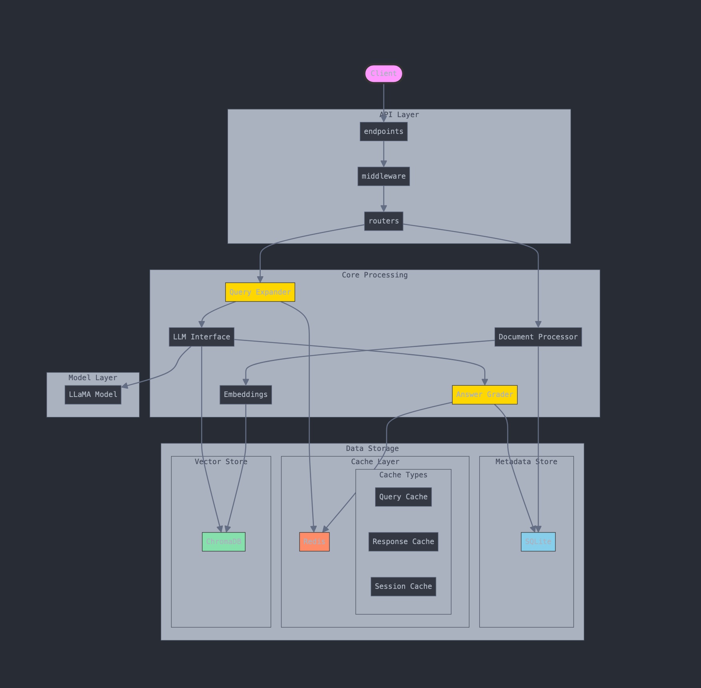

# LLaMA RAG Engine

A Retrieval-Augmented Generation (RAG) engine using the LLaMA model and ChromaDB.




## Table of Contents

- [Setup](#setup)
- [Usage](#usage)
- [Development](#development)
- [API Endpoints](#api-endpoints)
- [Swagger UI](#swagger-ui)
- [Contributing](#contributing)
- [License](#license)

## Setup

### Prerequisites

- Python 3.9 or higher
- Redis
- ChromaDB
- Ollama

### Steps

1. **Clone the repository**:
   ```sh
   git clone https://github.com/sudo-scorpion/llama-rag-engine.git
   cd llama-rag-engine
   ```

2. **Create a virtual environment**:
   ```sh
   python -m venv rag-env
   source rag-env/bin/activate
   ```

3. **Install dependencies**:
   ```sh
   pip install -r requirements.txt
   ```

4. **Copy `.env.example` to `.env` and configure**:
   ```sh
   cp .env.example .env
   ```

5. **Run the setup script**:
   ```sh
   chmod +x setup.sh
   ./setup.sh
   ```

This script will:
- Pull the Ollama model
- Start the Ollama server
- Start the Redis server
- Start the ChromaDB server
- Start the FastAPI application

## Usage

### Starting the Application

After running the setup script, the FastAPI application should be running on `http://localhost:8080`.

### API Endpoints

#### Upload Document

- **Endpoint**: `/upload_document`
- **Method**: `POST`
- **Description**: Upload a PDF document to be processed and indexed.
- **Request**:
  ```sh
  curl -X POST "http://localhost:8080/upload_document" -F "file=@/path/to/your/document.pdf"
  ```
- **Response**:
  ```json
  {
    "message": "Document processed successfully",
    "chunks_processed": 10
  }
  ```

#### Ask Question

- **Endpoint**: `/ask_question`
- **Method**: `POST`
- **Description**: Ask a question and get an answer based on the indexed documents.
- **Request**:
  ```json
  {
    "question": "What is the topic for Week 1?"
  }
  ```
- **Response**:
  ```json
  {
    "question": "What is the topic for Week 1?",
    "answer": "The topic for Week 1 is Introduction to Machine Learning.",
    "relevance_score": 0.95,
    "confidence_score": 0.9,
    "contexts": [
      {
        "document": "Introduction to Machine Learning.pdf",
        "score": 0.95
      }
    ],
    "response_time": 1.23,
    "error": null
  }
  ```

#### Get Metrics

- **Endpoint**: `/metrics`
- **Method**: `GET`
- **Description**: Retrieve performance metrics of the RAG system.
- **Response**:
  ```json
  {
    "avg_response_time": 1.23,
    "avg_relevance_score": 0.9,
    "current_temperature": 0.7,
    "temperature_history": [0.7, 0.8, 0.7],
    "total_documents_processed": 5,
    "total_queries": 10,
    "successful_queries": 9,
    "failed_queries": 1,
    "success_rate": 90.0
  }
  ```

#### Health Check

- **Endpoint**: `/health`
- **Method**: `GET`
- **Description**: Check the health status of the application.
- **Response**:
  ```json
  {
    "status": "healthy",
    "auth_mode": "dev",
    "rag_system": "initialized"
  }
  ```

## Swagger UI

FastAPI provides an interactive API documentation using Swagger UI. You can access it by navigating to `http://localhost:8080/docs` in your web browser.

### Features

- **Interactive API Documentation**: Explore and test the API endpoints directly from the browser.
- **Auto-generated**: The documentation is automatically generated based on the FastAPI application.

## Development

### Setting Up Development Environment

1. **Clone the repository**:
   ```sh
   git clone https://github.com/sudo-scorpion/llama-rag-engine.git
   cd llama-rag-engine
   ```

2. **Create a virtual environment**:
   ```sh
   python -m venv rag-env
   source rag-env/bin/activate
   ```

3. **Install dependencies**:
   ```sh
   pip install -r requirements.txt
   ```

4. **Copy `.env.example` to `.env` and configure**:
   ```sh
   cp .env.example .env
   ```

5. **Run the setup script**:
   ```sh
   chmod +x setup.sh
   ./setup.sh
   ```

### Running Tests

To run tests, use the following command:
```sh
pytest
```

### Linting

To lint the code, use the following command:
```sh
flake8
```

## Contributing

We welcome contributions to the LLaMA RAG System! If you have any ideas, suggestions, or bug reports, please open an issue or submit a pull request.

### Steps to Contribute

1. Fork the repository.
2. Create a new branch for your feature or bugfix.
3. Make your changes.
4. Submit a pull request with a detailed description of your changes.

## License

This project is licensed under the MIT License. See the [LICENSE](LICENSE) file for more details.